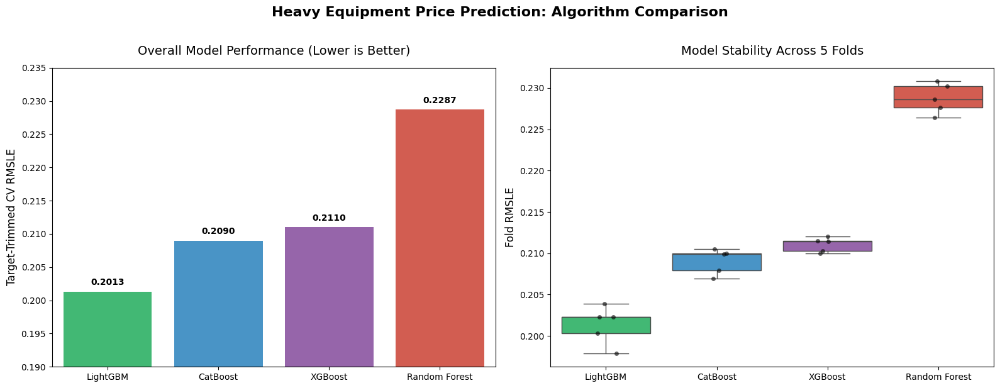

# Heavy Equipment Selling Price Prediction

> **Kaggle Competition Achievement:** Final Rank 41 out of 4,620 participants

## 1. Abstract & Problem Statement
The auctioning of heavy equipment represents a substantial secondary market where pricing is influenced by a myriad of complex, interacting factors including depreciation due to age, operational strain, physical configuration, and macroeconomic regional trends. Traditional linear depreciation models often fail to capture the nuances of heavy machinery valuation, such as the disproportionate value retention of premium brands or the non-linear impact of operational hours. 

This project aims to develop a robust, data-driven machine learning framework to accurately forecast the auction sale price of heavy equipment. By modeling the intricate relationships within historical usage data and machine specifications, the resulting algorithm seeks to minimize the Root Mean Squared Logarithmic Error (RMSLE), providing a highly precise financial valuation tool that mirrors complex real-world market dynamics.

## 2. Modeling Strategy
To ensure robustness and avoid overfitting, four distinct machine learning algorithms were trained and evaluated using a rigorous **5-Fold Cross-Validation** strategy. The primary metric used for evaluation was **Root Mean Squared Logarithmic Error (RMSLE)**, which penalizes relative errors rather than absolute errors. Furthermore, outlier target trimming was incorporated during training to stabilize model convergence.

### 2.1 Model Evaluation Results

| Model | CV RMSLE | Highlights |
| :--- | :--- | :--- |
| **LightGBM (Winner)** | **0.2013** | Outperformed all other models. Utilizes leaf-wise tree growth, making it exceptionally fast and accurate at handling complex data interactions. |
| **CatBoost (Runner Up)** | 0.2090 | Employs symmetric trees and is highly robust against overfitting. Naturally handles high-cardinality categorical features effectively. |
| **XGBoost** | 0.2110 | Provided a solid baseline with its depth-wise tree growth, though it required heavier pre-processing for raw categorical features. |
| **Random Forest** | 0.2287 | A highly stable baseline due to bagging, but struggled to extrapolate prices beyond those seen in the training data, yielding the lowest performance. |

## 3. Final Model Insights & Conclusion
The final solution relies on **LightGBM** after extensive hyperparameter tuning. The model generalized exceptionally well to the unseen test set, achieving a tuned **Kaggle Leaderboard RMSLE of 0.19284**, which secured a top 1% finish in the competition.

### Performance Visualization
Below is the final model evaluation visualization, demonstrating the precision and error distribution of the optimized LightGBM predictor:

*The visualization above highlights the strong alignment of our predictions following hyperparameter tuning and outlier target trimming.*
